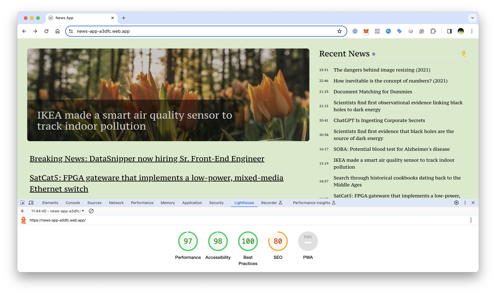

# News App

This application provides a minimal setup to display news stream parsed from CSV file.

[Demo](https://news-app-a3dfc.web.app/)

## Test plan:
- *Unit Tests*: Use Jest and React Testing Library to write unit tests for each component, ensuring they render correctly with mock data.
  - NewsItemBanner component
  - RecentNews component
  - ImportantNews component
  - ThemeSwitch
  - NewsApp
- *Integration Tests*: Test the interaction between components and data loading/parsing functionality.
  - Test parseCsv utility function
- *E2E Tests*: Utilize a tool like Cypress to simulate user interactions and verify the application behaves as expected in a real browser environment.
  - Test toggle dark mode button
- *Accessibility*: Ensure the application is accessible, using tools like axe or Lighthouse to audit.
